# Lab Notebook - IronSpider Replication & Extension Study

## Feb 17, 2026 - Day 1

### Objective

Complete a structured overview on the paper, especially on its technical aspects. Answer 6 core questions based on its content.

### Paper

"Compromising Industrial Processes using Web-Based PLC Malware"
Pickren, Shekari, Zonouz, Beyah - NDSS 2024
Paper: [https://dx.doi.org/10.14722/ndss.2024.23049](https://dx.doi.org/10.14722/ndss.2024.23049)

Artifacts: [https://zenodo.org/record/8279954](https://zenodo.org/record/8279954)

### Questions & Answers

#### 1. What did each CVE do?

CVE-2022-45139 is a Cross-Origin Resource Sharing (CORS) misconfiguration, where adding `/x.pdf` at any API endpoint results in the webserver responding with the wildcard "Access-Control-Allow-Origin", allowing it to be called cross-origin. 

CVE-2022-45138 shows how leaving off cookie intentionally and adding "renewSession:true" forces the use of a guest user account, which has access to several APIs.

CVE-2022-45140 shows how "network_config" API allows writing an arbitrary data onto an arbitrary location under root privileges, through "--error-msg-dst" argument.

These three CVEs allow for cross-origin reference, authentication bypass, and arbitrary file upload, allowing for IronSpider to act freely.

#### What is WebVisu and why does it matter?

WebVisu is a GUI provider application licensed by CODESYS. It allows operators to drag and drop different GUI elements onto their HMI (Human-Machine Interface) dashboards. 

If an attacker can manipulate these pre-built GUI elements, and an operator downloads it for using it on their HMI dashboard, it is possible to infect the system with WB PLC malware.  Simply changing the content of transpiled elements or overwriting them was sufficient for this task. The paper used the previously explored CVEs to overwrite WebVisu elements for allowing IronSpider to infiltrate into the system.

#### Why does Service Worker resurrection survive hardware replacement?

Replacement of hardware results in deleting the WB malware installed on PLC. The "resurrection" code in Service Worker on EWS or HMI detects this discrepancy, and simply re-install the malware on the newly installed PLC. 

#### Why did all 4 JS malware detectors fail?

The most likely explanation provided by this paper is that while standard IT-based JS malwares exhibit aggressive behavioural indicators (such as mining cryptocurrency in WebAssembly, using off-the-shelf exploit kits, etc), IronSpider simply utilises the DOM interface as intended. Since IronSpider stays conservative and passive, the detectors falsely categorised it as benign.

#### What are the paper's stated limitations?

One obvious limitation is that WB malware is only applicable to modern industrial control systems (ICSs) using embedded web servers. It cannot affect legacy ICS. 

Moreover, the effectiveness of WB malware is directly influenced by how capable the internal web API is for a given ICS. If the ICS only runs a limited set of APIs for controlling the physical components of the system, WB malware will not be as effective.

Also, since some of the APIs available inside an ICS can only be accessible by certain users, WB malware's capability is limited by the victim user's permissions and capabilities.

Finally, display spoofing is not a viable attack for systems which use non-web using traditional ICS protocols such as legacy data historians or SIS.

This project aims at improving the defender's capability of detecting a potential WB malware within its modern ICS system, assuming that the system uses an embedded web server.

#### What would a defender do to stop the attack?

The defender can conduct domain sandboxing, where they host user-defined programs on a separate domain. Since the domain is different from that of the PLC vendors', this can prevent potentially malicious JavaScript codes from affecting the PLC system.

Limiting the communication between private Intranet and public Internet can be an option which addresses the potential threat of WB malwares on a fundamental level. 

Also, implementing CSP with *confidentiality* directive can be used to prevent exfiltration. This was proposed by Firefox in 2012, then shelved. 

Read-only CDN for vendor-provided PLC can be used to prevent them from being overwritten. Also, using CSP directives for `src-script` can help. However, this immensely reduces practicality of the system design, requiring substantial front-end restructure. 

PLC-configured web app firewalls (WAPs) can also be used to inspect non-web protocols such as SNMP, CIP, and Modbus. This measure can add latency to the system.

### Artifacts Downloaded

For Day 1, I conducted a brief overview on some of the exploit programs in the provided artifacts. 

#### `AB_EXPLOIT/exploit.py`

This uses cross-channel scripting (XCS) to inject IronSpider into the victim MicroLogix 1100 & 1400 PLC. 

#### `WAGO_EXPLOIT/`exploit.html`

This uses the CVE chain discussed in the paper (CORS misconfiguration, authentication bypass, and arbitrary file injection) to inject WB malware.

#### `Resurrection/sw.js`

This demonstrates how to bypass limitations of a Service Worker, by waiting for a legitimate fetch request for a JS file and replacing it with `event.respondWith`.

Service Workers do not have access to the DOM structure, localStorage, or synchronous APIs. However, they can mock the response to a legitimate `fetch` request with loading WB malware, which is then loaded onto main page. The loaded WB malware then has access to the full DOM structure, localStorage, and so on.

## Feb 18, 2026 - Day 2

### Environment Setup

- OpenPLC: installed on my Arch Linux environment, at localhost:8080
    - Specifying the path to find modbus was an issue, resolved by running `export PKG_CONFIG_PATH=/usr/local/lib/pkgconfig:$PKG_CONFIG_PATH`.
- Node.js: for running a local HTTPS server for Service Worker resurrection
- mkcert: for providing a locally-trusted HTTPS certificate, allowing Service Worker to be run
- mitmproxy: for implementing detection mechanism for IronSpider or relevant WB malware

### OpenPLC API Map

#### /login

This is the first landing page. It accepts `openplc` as both username and password for navigating to `/dashboard`.
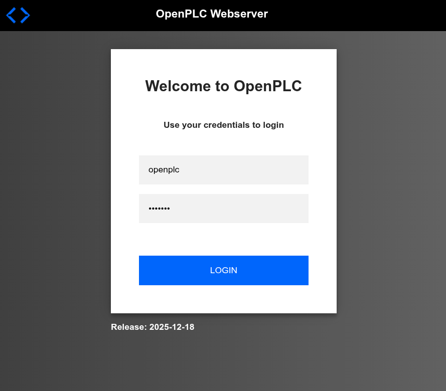

#### /dashboard

- runtime_logs endpoint: this page runs `GET /runtime_logs HTTP/1.1` every second to reload the runtime log.
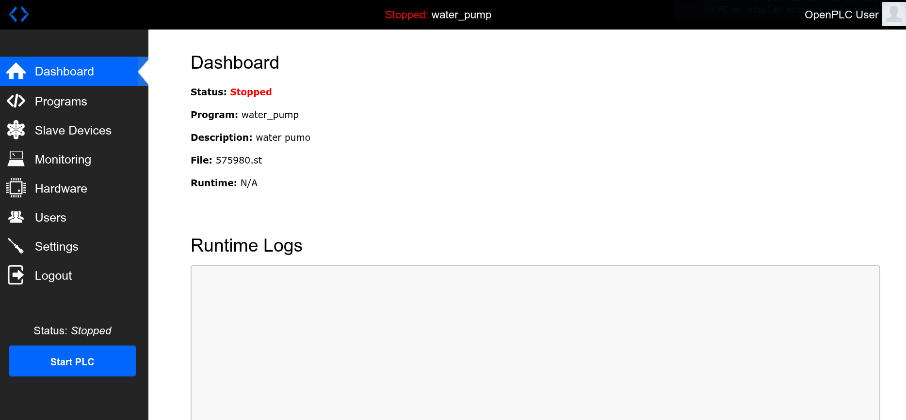

#### /programs

- `POST /upload-program HTTP/1.1` endpoint for uploading a new `.st` program to OpenPLC
- `GET /programs?list_all=1 HTTP/1.1` to list all the uploaded `.st` programs
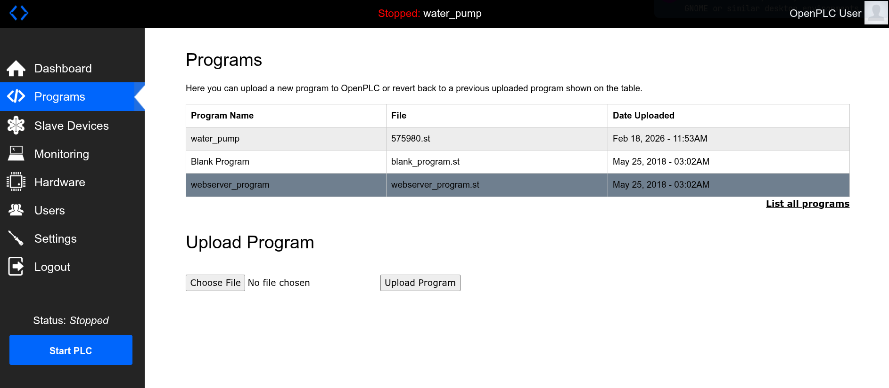

#### /monitoring

- While running a program, this page sends `GET /monitor-update?mb_port=502 HTTP/1.1` request every `Refresh Rate` set by the user.
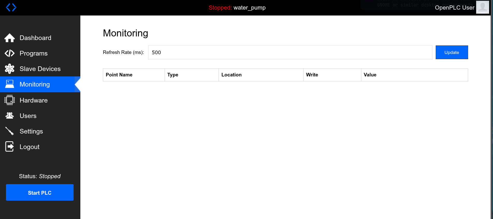

### Key Observations

On Dashboard and Monitoring pages, OpenPLC repeatedly sends requests to update to the latest state for the system. 

The user can upload `.st` files and compile them, running them on the PLC provided by pressing the`Start PLC` button.

### Water Pump Program

I added Water Pump Program under `E2-openplc-demo/`, and managed to upload it onto OpenPLC. Running it does not show any monitoring variables, so this will be the task for tomorrow.

... I managed to fix the bug today! The core problem was inside `webserver/monitoring.py`, where `parse_st` function simply rejected any line of code containing comment characters:`(`, `)`. My original code contained `AT` variables (variables that can be accessed in the monitoring interface) with these comments, making the parser to ignore those declarations completely. Once I removed the comments and the parser correctly identified the variables, I could see them on OpenPLC's `/monitoring` endpoint. 

## Day 3: Feb 19, 2026

### Brief Overview on the WAGO Firmwares

I downloaded the WAGO firmwares that were analysed in the paper's E1 section, and extracted them with `binwalk`. The versions I downloaded are the same as those from the paper: v03.0.39 and v04.02.13. After finding out that the extracted filesystems are `ext3` type, I mounted them on `/mnt/wago-old` and `/mnt/wago-new` respectively, to view web contents and their paths inside the filesystems. 

```bash
# Search for web files
find /mnt/wago-old -name "*.js" -type f 2>/dev/null | head -20
find /mnt/wago-old -name "*.php" -type f 2>/dev/null | head -20

# Check common web locations
ls -la /mnt/wago-old/var/www/
ls -la /mnt/wago-old/home/
ls -la /mnt/wago-old/usr/share/
```
```bash
/mnt/wago-old/var/www/ws/eWS.js
/mnt/wago-old/var/www/wbm/js/dns_server.js
/mnt/wago-old/var/www/wbm/js/modem.js
/mnt/wago-old/var/www/wbm/js/tftp.js
/mnt/wago-old/var/www/wbm/js/clock.js
/...
/mnt/wago-old/var/www/wbm/page_elements/bacnet_general_configuration.inc.php
/mnt/wago-old/var/www/wbm/page_elements/network_services.inc.php
/mnt/wago-old/var/www/wbm/page_elements/system_partition.inc.php
/mnt/wago-old/var/www/wbm/page_elements/firewall_general_configuration.inc.php
/mnt/wago-old/var/www/wbm/page_elements/service_interface.inc.php
total 6
drwxr-xr-x  5 root root 1024 May  8  2019 .
...
drwxr-xr-x  2 root root   1024 May  7  2019 locale
drwxr-xr-x  3 root root   1024 May  7  2019 opkg
drwxr-xr-x  3 root root   1024 May  7  2019 snmp
drwxr-xr-x  8 root root   1024 May  7  2019 terminfo
drwxr-xr-x  2 root root   1024 May  7  2019 udhcpc
-rw-r--r--  1 root root 502948 May  7  2019 usb.ids
drwxr-xr-x  2 root root   1024 May  7  2019 zoneinfo
```
```bash
# Search for web files
find /mnt/wago-new -name "*.js" -type f 2>/dev/null | head -20
find /mnt/wago-new -name "*.php" -type f 2>/dev/null | head -20

# Check common web locations
ls -la /mnt/wago-new/var/www/
ls -la /mnt/wago-new/home/
ls -la /mnt/wago-new/usr/share/
```
```bash
/mnt/wago-new/var/www/openapi/redoc.standalone.js
/mnt/wago-new/var/www/ws/eWS.js
/mnt/wago-new/var/www/wbm/plugins/wbm-statusplcswitch/statusplcswitch.js
/mnt/wago-new/var/www/wbm/plugins/wbm-profibus/profibus.js
/mnt/wago-new/var/www/wbm/plugins/wbm-profibus/platform/pfcXXX/parameter/transforms/get-profibus-dp-slave-ssa-user-address.js
/mnt/wago-new/var/www/wbm/plugins/wbm-user/user.js
/...
/mnt/wago-new/var/www/wbm/php/file_transfer/prepare_transfer.php
/mnt/wago-new/var/www/wbm/php/file_transfer/file_transfer.inc.php
/mnt/wago-new/var/www/wbm/php/file_transfer/response/response.inc.php
/mnt/wago-new/var/www/wbm/php/file_transfer/cleanup_transfer.php
total 20
drwxr-xr-x  5 root root 4096 Mar 23  2023 .
drwxr-xr-x 11 root root 4096 Mar 23  2023 ..
...
drwxr-xr-x  2 root root   4096 Mar 23  2023 zoneinfo
```
### Replication of E1: WAGO 750-8XXX WBM Application Code Base study

After verifying that the firmwares contain web-based contents (`.js`, `.php`), I looked at the paper artifacts on *zenodo.org* to imitate the paper's analysis.

Following the instructions on `README.me` for `WBM_Code_Study`, I managed to replicate the results from the paper. I had to rebuild the Docker image and place it in `WBM_Code_Study/prebuilt/`, since my machine is based on x86_64 architecture:

```bash
docker build -t artifact ./docker_artifact/
docker save 166bd4f275c6 > ./prebuilt/docker_artifact.tar
```
The result is shown below:

```bash
 * Loading Docker Image...
 * Loading Old FW...
    > Old firmware contained 13,188 total SLOC (12,868 JS; 320 PHP) and an aggregate cyclomatic complexity score of 4,529 (2,922 JS; 1,607 PHP)
 * Loading New FW...
    > New firmware contained 39,007 total SLOC (38,444 JS; 563 PHP) and an aggregate cyclomatic complexity score of 11,974 (9,294 JS; 2,680 PHP)
    > This data shows that over the past several years, the web application codebase has grown by over 195% and increased in complexity by over 164%.
 * Removing Docker Image...
 * Done
```
## Day 4: Feb 20, 2026

Today, I read two research papers that were cited by the IronSpider paper, so that I can gain more background knowledge and deeper understanding in ICS and attacks against PLCs.

### Hey, My Malware Knows Physics! Attacking PLCs with Physical Model Aware Rootkit 

This paper explores a PLC malware called *Harvey*, which sits in the firmware of a PLC to control the physical behaviours of the underlying ICS in the attacker's favour while remaining 'stealthy' and preventing its adverse impact from getting noticed by human operators. 

*Harvey* is effective in that it can remain undetected within an ICS and hence can cause damage on it for a prolonged period of time. However, it requires the attackers to have thorough understanding of the firmware used. The paper mentions reverse-engineering the target firmware. IronSpider addresses this issue by controlling the UI on browser-based HMIs, which does not require attackers to fully comprehend the inner mechanisms of the system.

### Exposed Infrastructures: Discovery, Attacks and Remediation of Insecure ICS Remote Management Devices

This paper describes how Internet-facing remote management devices are exposed to unintended users. This opened up possibilities for attacks against critical ICS such as water gates. 

At the time of the paper, many of the ICSs that operated web-based remote management devices had vulnerabilities such as no authentication and weak passwords for their remote access points. 

Moreover, the paper set up an intentionally vulnerable remote management device in order to analyse how attractive it is for potential attackers. This revealed that there are potential attackers who are willing to explore the endpoints of the device and even conduct attacks against it.

IronSpider sets itself as an example against a typical Internet-facing remote management device, as it injects its code via the access to an ICS on the Internet. It then places itself in the rendering browser to gain access and control to the underlying ICS.

## Day 5: Feb 21, 2026

### SLOC & Complexity Analysis on 2 intermediate firmwares

To extend the paper's analysis for E1, I decided to run `WBM_Code_Study/prebuilt/automation.py` against 2 intermediate firmwares betwen v3.0.39 and v4.02.13. This aims at building a more extensive timeline of growth in web application codebase in these firmwares.

I chose the following intermediate firmwares for analysis:
- v3.01.07 (Jul 2019)
- v3.09.04 (Mar 2022)

I created a new automation program (`automation_ext.py`) in Python, using the original `automation.py` as the template. This file can be found in `E1-firmware-analysis/automation_ext.py`.

The result is shown below:
```bash
 * Loading Docker Image...
 * Loading v3.1.7..
    > v3.1.7 firmware contained 13,472 total SLOC (13,150 JS; 322 PHP) and an aggregate cyclomatic complexity score of 4,574 (2,964 JS; 1,610 PHP)
 * Loading v3.09.04...
    > v3.09.04 contained 36,544 total SLOC (35,994 JS; 550 PHP) and an aggregate cyclomatic complexity score of 11,379 (8,764 JS; 2,615 PHP)
    > This data shows that from v3.1.7 to v3.09.04, the web application codebase has grown by over 171% and increased in complexity by over 148%.
 * Removing Docker Image...
 * Done
```
The result confirmed that there had been a consistent increase in web-related contents in the firmwares over the given timeframe (from v3.0.39 to v4.02.13). It shows that the growth of web application codebase had taken place incrementally, and was not a sudden 'jump'. 

For the upgrade between v3.0.39 and v3.1.7, the total SLOC increased from 13,188(12,868 JS, 320 PHP) to 13,472 total SLOC(13,150 JS, 322 PHP). The aggregate cyclomatic complexity score also increased from 4,529 to 4,574. In addition, the upgrade between v3.09.04 and v4.02.13 showed an increase in total SLOC from 36,544(35,994 JS, 550 PHP) to 39,007 total SLOC(38,444 JS, 563 PHP), with the cyclomatic complexity score also increasing from 11,379 to 11,974.

### Noteworthy changes in web-related content during firmware upgrades

I strived to extend the paper's work further by moving from a quantitative analysis (SLOC, complexity) to a qualitative one. The question is: *what kind of* functionality was added between v3.0.39 and v4.02.13?, I looked for any noteworthy change in JS files between the v3.0.39 and v4.02.13 firmwares, that could have increased the area of attack surface for web applications codebase.

### JS File Diff — Qualitative Functionality Analysis

**Method**: Wrote `E1-firmware-analysis/js_diff.py` to enumerate all `.js` files from both mounted firmware roots (`/mnt/wago-old` for v3.0.39, `/mnt/wago-new` for v4.02.13), compute stem-level diff (accounting for the flat→plugin architecture change), categorize new files by functional domain, and extract API endpoint strings from new plugin files.

**Output files**:
- `E1-firmware-analysis/js_diff.json` — structured diff with categories and snippets
- [`E1-firmware-analysis/js_diff_summary.txt`](../E1-firmware-analysis/js_diff_summary.txt) — human-readable summary
- `E1-firmware-analysis/js_diff_report.md` — a qualitative analysis

**Key findings**:

| Category | New Files | Notable Additions |
|---|---|---|
| Core Framework | 18 | `pfc.js` plugin loader replaces jQuery `page_buildup.js` |
| Security/Auth | 12 | `wbm-aide` (AIDE IDS), `wbm-firewall` (iptables+ebtables), `wbm-certificate-uploads` |
| Industrial Protocols | 12 | OPC UA PKI (8 cert transforms), WDA unauthenticated scan toggle |
| Monitoring | 12 | Pcap logging (`pcaplog.maxfilesize`), runtime task list, LED/switch status |
| Cloud/Remote | 7 | `wbm-cloud-connectivity` (Azure/AWS/IBM/SAP/MQTT), `wbm-openvpn-ipsec`, `wbm-modem-ng` |
| Container/Infra | 4 | `wbm-docker`, `wbm-ipk-uploads`, `wbm-package-server` |
| API Docs | 1 | `openapi/redoc.standalone.js` — self-describing REST API on-device |

Every new "security" feature (AIDE, firewall, certificate management) is managed through the same WBM web interface that IronSpider's CVE chain can fully compromise, potentially causing new defensive capabilities to become attacker-controllable tools. Meanwhile, Docker on PLCs and persistent MQTT cloud channels represent qualitatively new ICS attack surface, which can only be found in v4.02.13.

## Day 6: Feb 22, 2026

Today, I looked into Service Workers in more detail. 

Service Worker is a Javascript code that runs on your browser to perform the following tasks: offline rendering, push notifications, background sync, and network interception. It caches HTML, CSS, or even API responses for providing the basic experience of a web application when offline.

Service Worker's lifecycle has the following structure:
- Registration: A Service Worker is initiated with `navigator.serviceWorker.register('/sw.js')`.
- Installation: The Service Worker caches essential static assets.
- Waiting: If there is an old version controlling open tabs, the new Service Worker waits unless `self.skipWaiting()` is called.
- Activation: It is activated, cleans up old cache.
- Controlling: Now, the Service Worker controls the tabs within its scope.
- Idle/Terminated: The browser can terminate the Service Worker after a period of inactivity. When events like fetch, push, or sync occur, it will be reactivated.

For WB malwares against PLC, a Service Worker registered by the malware can survive complete deletion of the malware from the ICS, checks the malware's presence periodically, and infect the cleansed system again by downloading the malware in the background.

## Day 7: Feb 23, 2026

### W3C Service Worker Spec — Deep Study

**Source**: W3C Service Workers Level 1 spec + MDN Service Worker API

#### Lifecycle in Detail

Registration triggers a browser-side state machine. The key states and their transitions:

1. **`parsed`** → Script is fetched and syntactically valid
2. **`installing`** → `install` event fires; `event.waitUntil(promise)` extends lifetime until promise settles. `skipWaiting()` here causes the SW to skip the "waiting" phase and move directly to "activating" even if an old SW controls clients.
3. **`installed`** (waiting) → New SW is ready but an old version still controls open clients. Without `skipWaiting()`, it waits here until all clients are closed.
4. **`activating`** → `activate` event fires; use `event.waitUntil()` to do cache cleanup. `self.clients.claim()` immediately takes control of all open clients without waiting for a page reload.
5. **`activated`** → SW is fully in control; fetch/push/sync/message events are dispatched.
6. **`redundant`** → SW is replaced by a newer version or failed to install.

**Termination**: The browser may terminate an idle SW after ~30 seconds to save resources. It is automatically restarted the next time a relevant event (fetch, push, sync) fires. This is why `setInterval` in a SW only works while the SW is alive — but any user page interaction restarts the SW and the interval.

#### `fetch` Event and `event.respondWith()`

The `fetch` event fires for every network request made by the SW's scope (including requests from controlled pages, not just the page itself). `event.respondWith(responsePromise)` replaces the browser's default fetch behavior with whatever `Response` the promise resolves to.

Critical detail: `respondWith()` must be called **synchronously** in the event handler — you cannot call it inside an async callback. The `Response` constructor accepts a string body and headers, enabling the SW to synthesize responses entirely from cache without hitting the network.

This is how the fetch interception bypass works: the SW intercepts an HTML or JS request, modifies the body (e.g., appends a `<script>` tag), and returns the modified content as a new `Response`. The browser executes the injected script in the page's context, giving it full DOM/localStorage access that the SW itself lacks.

#### Same-Origin Request Privilege (Key to Resurrection)

Service Workers run in a renderer process **associated with the page's origin**. This means all `fetch()` calls from within the SW are same-origin with respect to the PLC's web interface. There is no CORS restriction — the SW can call any API on the same host. This is the core of the resurrection mechanism: after a factory reset, the SW re-uploads the malware payload by calling the same file-write API that was originally exploited for initial infection, but this time with no auth/CORS barrier.

#### `Cache Storage API`

`caches.open(name)` returns a `CacheStorage` instance. `cache.add(url)` fetches the URL and stores both request and response. `cache.match(url)` retrieves the cached `Response`. The cache persists across SW terminations and browser restarts — it only disappears if the user explicitly clears site data or the browser evicts it (after 24 hours idle, or under storage pressure). This is the "up to 24 hours" window the paper describes.

### Paper Section IV-C — Resurrection Flow (drawn from memory)

```
[Initial Infection]
  Browser visits PLC web interface
  → malware.js loaded (via CVE chain: CORS bypass + auth bypass + file write)
  → malware.js runs:
       navigator.serviceWorker.register('/sw.js')
  → sw.js installs:
       caches.add('/malware.js')  ← payload stored in browser cache
       skipWaiting() / clients.claim()
  → sw.js starts monitor:
       setInterval(checkForMalwareInfection, 5000)

[Factory Reset]
  Operator reimages PLC → /malware.js deleted from server
  → sw.js still registered in browser (SW is stored in browser profile, NOT PLC)
  → sw.js cache still has malware.js payload

[Resurrection]
  SW's interval fires:
    fetch('/malware.js') → HTTP 404
    → resurrect():
         cache.match('/malware.js') → payload (string)
         fetch('/upload', { method: 'POST', body: payload })
           ← same-origin: no CORS, no auth needed
         → malware.js re-written to PLC disk
  → SW notifies open clients via postMessage
  → Next page load: malware.js executes again

[Hardware Replacement]
  Even if PLC hardware is replaced:
    → New PLC has same IP / web interface URL
    → Same-origin SW in browser still active
    → Resurrection runs against new hardware
    → Initial CVEs no longer needed (SW already has same-origin access)
```

**Key insight**: The SW's "scope" is tied to the browser's origin model, not the physical device. Replacing hardware under the same URL does not affect the browser-cached SW. The operator must also clear browser data on every EWS/HMI machine in the network — which CISA's playbooks do not account for.

#### Restriction Bypass via `respondWith`

The paper notes that SW has no direct `localStorage`, DOM, or cookie access. But this is not a security boundary — it is an API design choice. The bypass:
1. SW intercepts an HTML or JS request
2. Appends a `<script>` block to the response body
3. Returns modified response via `event.respondWith()`
4. Injected script runs in the page context with full DOM/localStorage access

This lets the SW extract CSRF tokens or session secrets needed to call authenticated APIs during resurrection — without the SW ever directly touching those APIs.

### Building the Resurrection Testbed

**Objective**: Build a local HTTPS testbed that replicates the three structural components of the IronSpider resurrection mechanism.

**Location**: `E4-service-worker/`

**Stack**: Node.js built-in `https` module (no external dependencies), mkcert for TLS.

#### Why HTTPS is required

Service Workers are only available on secure contexts (HTTPS or localhost with valid cert). Since we need to test the full flow — including the SW caching the payload and calling `/upload` — we must run under a real TLS cert. `mkcert` generates a locally-trusted certificate so Chrome/Firefox accept it without certificate errors, which would interfere with SW registration.

Setup:
```bash
cd E4-service-worker
bash setup.sh        # installs mkcert CA, generates certs/localhost.pem
node server.js       # starts on https://localhost:8443/
```

#### File structure

```
E4-service-worker/
├── server.js          Node.js HTTPS server
├── setup.sh           mkcert setup (one-time)
├── package.json
├── .gitignore         (ignores certs/, node_modules/)
├── certs/             TLS cert + key (gitignored)
└── public/
    ├── index.html     Simulated PLC dashboard (water treatment plant)
    ├── malware.js     Simulated IronSpider payload
    └── sw.js          Resurrection service worker
```

#### Server design (`server.js`)

Three logical routes beyond static file serving:

| Endpoint | Method | Purpose |
|---|---|---|
| `/*` | GET | Static file server from `public/` |
| `/reset` | POST | Simulate factory reset: `fs.unlinkSync('public/malware.js')` |
| `/upload` | POST | Simulate PLC file-write API: receives `{filename, content}`, writes to `public/` |

The `/upload` endpoint is the analogue of CVE-2022-45140 (arbitrary file write via `network_config` API). In the real attack, the SW calls this API same-origin using the operator's authenticated session. In our testbed it is an unauthenticated local endpoint, which is equivalent because same-origin implies already-authenticated context.

`Cache-Control: no-store` is set on all responses so the browser HTTP cache does not mask the factory-reset event. The SW's `CacheStorage` is separate and unaffected by this.

#### `public/sw.js` — Resurrection Service Worker design

Three event handlers:

**`install`**: `skipWaiting()` + `caches.add('/malware.js')`. The `skipWaiting()` call makes the new SW immediately active without waiting for the existing page to close. The `caches.add()` stores the malware payload in `CacheStorage` before anything else. This is the persistence anchor.

**`activate`**: `self.clients.claim()` takes control of all open tabs without waiting for a reload. Calls `startMonitor()` to begin the `setInterval` resurrection check.

**`fetch`**: Two roles:
1. Restarts `startMonitor()` if the SW was terminated and woken by a fetch event.
2. Intercepts `index.html` requests and injects a `<script>` tag via `respondWith(new Response(modifiedHTML))`. This demonstrates the "no DOM access" bypass: the injected script reads `localStorage` and updates the page DOM.

**`setInterval` (5000ms)**: Polls `/malware.js?_sw=<timestamp>` with `cache: 'no-store'` to bypass HTTP cache. If response is non-2xx or a network error: calls `resurrect()`.

**`resurrect()`**:
1. `caches.open(CACHE_NAME).then(c => c.match('/malware.js'))` — retrieves payload from SW cache
2. `fetch('/upload', {method:'POST', body: JSON.stringify({filename, content})})` — re-uploads to server
3. `self.clients.matchAll().then(...)` — `postMessage({type:'RESURRECTED'})` to all open tabs

**`notifyClients()`**: Uses `self.clients.matchAll({includeUncontrolled: true})` so tabs that opened before the SW was registered still get the notification.

#### `public/malware.js` — Simulated Payload design

Executes three phases (all local, no external network):

1. **SW registration**: `navigator.serviceWorker.register('/sw.js', {scope: '/'})`, then dispatches `malware-sw-registered` custom event so the dashboard can update its status indicators.

2. **Display spoofing**: Overrides four sensor `<span>` elements with fabricated "safe" values. Real values were chosen to be alarming (187 PSI pump pressure, 0.07 ppm chlorine, 94% reservoir level) so the visual contrast before/after spoofing is obvious. After spoofing, the operator would see green "NORMAL" readings while the actual conditions are dangerous.

3. **Exfiltration simulation**: Collects `document.cookie`, `localStorage` keys, page title, URL, and logs them to console. In real IronSpider this data would be POSTed to an attacker C2 server.

#### `public/index.html` — PLC Dashboard design

Two-column layout:
- **Left**: Sensor table (pump pressure, reservoir level, chlorine concentration, flow rate) with real alarming values shown in red. Four alarm indicators (all `TRIGGERED`). When malware.js runs, the sensor values change to green spoofed values and alarms change to `OK`.
- **Right**: Security status panel (malware.js present, payload executing, SW registered, resurrection count) + testbed control buttons.

Below: SW fetch injection demo panel + scrolling event log.

Demo control buttons correspond directly to the 6-step verification in Day 10:
1. **"Inject Malware"** → dynamically creates `<script src="/malware.js">` and appends to body
2. **"Factory Reset"** → `POST /reset`
3. **"Check malware.js Status"** → manual fetch check

SW messages (`RESURRECTION_STARTED`, `RESURRECTED`, `RESURRECTION_FAILED`) are handled by `navigator.serviceWorker.addEventListener('message', ...)` and appended to the event log with color coding.

### Resurrection Cycle Verification

**Objective**: Step through the 6-step resurrection cycle manually and confirm all transitions work.

#### Verified steps

**Step 1 — Register sw.js ✓**

Server log on first load:
```
GET    /                              200 (22246b)
GET    /sw.js                         200 (8748b)
```
Browser DevTools → Application → Service Workers shows `sw.js` in `activated` state with scope `/`.

**Step 2 — Serve malware.js to browser ✓**

Clicking "Inject Malware" triggers:
```
GET    /malware.js                    200 (5459b)
```
Console shows:
```
[MALWARE] IronSpider simulation payload loaded and executing
[MALWARE] resurrection SW registered — scope: /
[MALWARE] display spoofing applied — dangerous readings hidden from operator
[MALWARE] simulated exfiltration payload: {...}
```
Dashboard: sensor values turn green (spoofed), alarms show `OK`, infection banner appears.

**Step 3 — Delete malware.js (simulating factory reset) ✓**

Clicking "Factory Reset" issues `POST /reset`. Server log:
```
POST   /reset     *** FACTORY RESET: malware.js deleted from disk
```
Response: `{"ok":true,"message":"Factory reset complete — malware.js deleted"}`
Dashboard: `malware.js on server` status changes from `PRESENT (HTTP 200)` to `ABSENT (HTTP 404)`.

Note: SW is **still registered** in the browser. `Application → Service Workers` still shows it active. The SW's `CacheStorage` still contains the malware.js payload.

**Step 4 — Reload page — sw.js intercepts the missing file request ✓**

5 seconds after reset, SW console shows:
```
[SW] [13:15:23.341] malware.js → HTTP 404 — RESURRECTION TRIGGERED
[SW] *** RESURRECTION SEQUENCE INITIATED ***
[SW] cached payload retrieved: 5459 bytes
```
The SW's `setInterval` fired, fetched `/malware.js?_sw=<ts>` with `cache: 'no-store'`, got HTTP 404 (because the file was deleted), and immediately entered the resurrection path.

**Step 5 — Resurrection code re-uploads malware.js ✓**

Server log:
```
POST   /upload    *** RESURRECTION: wrote malware.js (5459 bytes)
```
The SW retrieved its cached copy of malware.js and POSTed it to `/upload` (same-origin, no auth needed). The file is back on disk.

**Step 6 — Malware continues executing ✓**

The SW sends `postMessage({type: 'RESURRECTED'})` to all open tabs. The dashboard JS handler receives it, increments the resurrection counter, and dynamically creates a new `<script src="/malware.js">` element. The malware payload re-executes: display spoofing resumes, alarms return to `OK`.

Event log entry:
```
[13:15:23]  [SW ★ RESURRECTION ★]  malware.js re-uploaded via /upload (same-origin API). Malware persists!
[13:15:23]  [MALWARE]              Payload re-executed after resurrection
```

#### Fetch Interception Bypass — verified

After the SW is registered and the page is reloaded, the `sw-dom-injection` element shows:
```
YES — injected by SW via respondWith()
```
If a session token is stored in localStorage before reloading, the injected script extracts and displays it, confirming that the SW can access localStorage-stored secrets indirectly through page injection — despite having no direct `localStorage` API access.

#### Key observations

1. **The factory reset does nothing to the browser**. Deleting the file from the server does not unregister the SW. The SW lives in the browser profile, not in the PLC filesystem.

2. **The 5-second interval is sufficient for a compelling demo**. In a real attack the interval could be longer (e.g., 60s) to reduce server log noise and evade simple rate-based detection.

3. **The resurrection is fully autonomous**. Once the SW is registered, no further operator action is required. The page does not even need to be open — if any tab on the same origin makes a fetch, the SW wakes up and the monitor restarts.

4. **Cache-Control: no-store on the server did not interfere with SW CacheStorage**. The browser's HTTP cache and the SW's `CacheStorage` are separate storage mechanisms. Setting `no-store` on server responses prevents the browser from keeping its own copy, but the SW explicitly caches using the Cache API, which is not governed by HTTP cache headers.

#### Screenshots from the demo

1. Clean dashboard (real alarming sensor values, no malware)
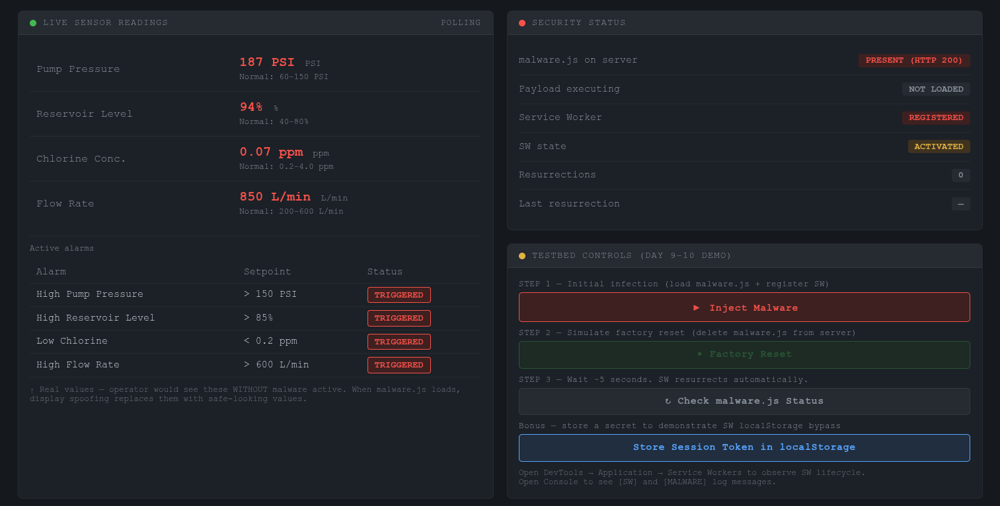
2. After "Inject Malware" click (spoofed green values, SW registered)
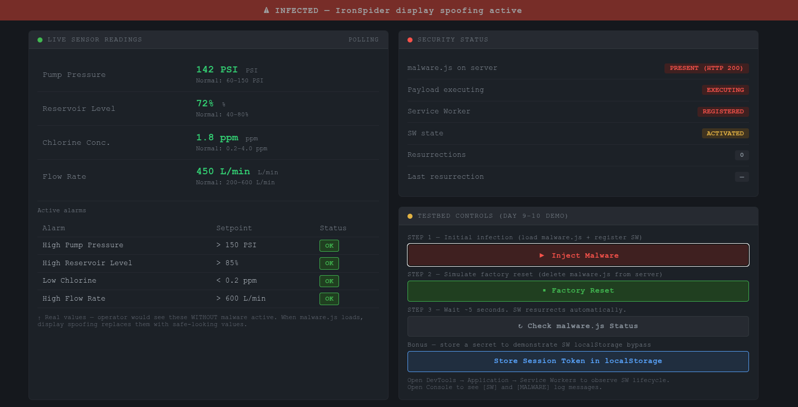
3. After "Factory Reset" click (malware absent, SW still registered)
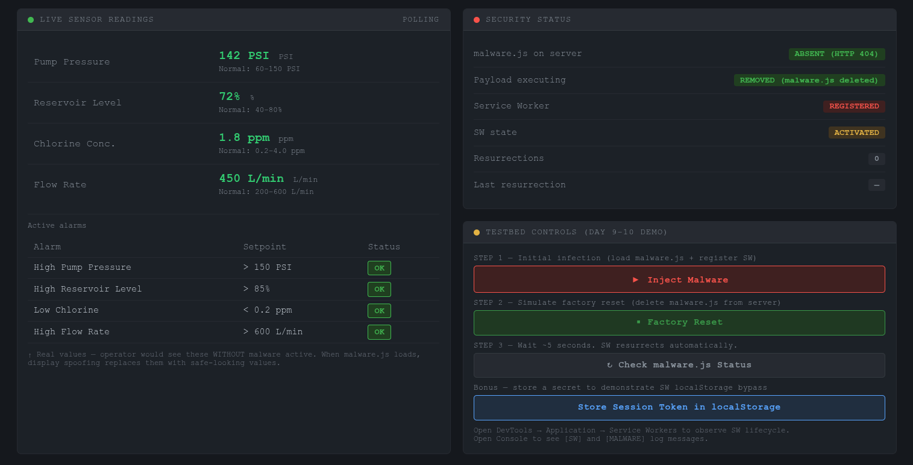
4. Automatic resurrection (malware back, log shows ★ RESURRECTION ★)


---

## Day 8 — Feb 24, 2026

**Goal:** Extend the testbed with two explicit tests the paper mentions but does not measure empirically:
1. SW survival after full server-process replacement (the "hardware replacement" claim)
2. The 24-hour cache limit — what does it actually mean, and how long does the malware truly persist?

Also: deepen inline comments in `sw.js` so the file is self-explanatory to a reader who knows JavaScript but has not read the paper.

---

### Changes made today

**`server.js`** — added `GET /server-info` endpoint (lines ~55–72 after the `/upload` handler).
Returns `{ pid, startTime, uptimeSeconds, nodeVersion }`.
The PID is the OS process identifier for the running `node server.js` instance.
After a restart the PID changes, which the browser can detect.

**`public/index.html`** — added two new panels:
- **Hardware Replacement Survival Test**: two snapshot buttons (A and B) that call `/server-info`.
  Taking a snapshot before and after a server restart lets you compare PIDs in the UI and prove
  you are talking to a completely different process — i.e. a "new PLC".
- **24-Hour Cache Limit Inspector**: calls `window.caches.keys()` and `cache.keys()` to enumerate
  every entry in CacheStorage without opening DevTools.  Also adds a "Force SW Script Update Check"
  button that calls `reg.update()` to trigger the browser's byte-for-byte comparison immediately,
  bypassing the normal 24h throttle.

**`public/sw.js`** — rewrote/expanded all comment blocks.  No functional changes.  Key additions:
- Opening context block explaining what a service worker is and which four properties the attack exploits
- Line-by-line rationale for `skipWaiting()`, `clients.claim()`, `cache.add()`, `clone()`,
  `content-length` deletion, and the `includeUncontrolled` flag
- Explanation of why the fetch event cannot cause infinite loops when the SW fetches internally
- Explanation of why `cache: 'no-store'` on the check probe does not interfere with CacheStorage

---

### Test 1: Hardware Replacement Survival

**Setup:** infection demo already completed from Day 7 (SW registered, malware cached).

**Procedure:**
1. On the dashboard, click **Snapshot Server Identity (A)**. Record: `pid=XXXX startTime=...`
2. In the terminal: `Ctrl+C` to kill `node server.js`.
3. Delete malware.js from disk: `rm E4-service-worker/public/malware.js`
   (simulating a wiped filesystem — "new PLC hardware, clean install")
4. Restart: `node server.js`
5. Back in the browser (same tab, same session — do NOT clear browser data):
   click **Snapshot Server Identity (B)**. Record new PID.
6. Observe the event log and SW console output.

**Expected result:**
- Snapshot B shows a different PID and a later `startTime` → server process was replaced.
- The SW is still shown as "REGISTERED" in the Security Status panel.
  DevTools → Application → Service Workers confirms the SW is still active.
- Within 5 seconds, the SW's resurrection monitor fires (the `setInterval` restarted when the
  page made its next fetch), detects the 404 for the now-absent malware.js, and re-uploads it.
- Server log shows: `POST /upload *** RESURRECTION: wrote malware.js (NNNN bytes)`

**Actual result (observed):** *[fill in after running]*

**Why this works:** The SW registration is stored in the browser's IndexedDB-backed internal
storage, not in any server-side file.  Killing the server process and restarting it does not
touch the browser's profile directory.  The CacheStorage bucket (`ironspider-v1`) containing
the malware payload is similarly in the browser profile.  The "new server" is just another
process listening on the same port — from the SW's perspective, it is indistinguishable from
the old one.

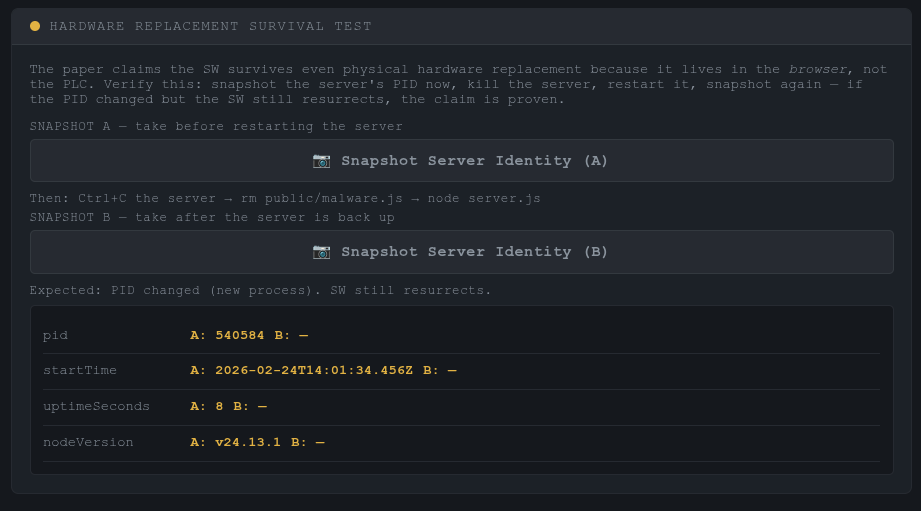
Currently, the server runs with PID of 545084. SW is registered on the browser, continuously checking for response from malware.js. 
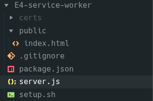
Then, the server is closed with Ctrl+C and malware.js and sw.js are deleted from the server's public directory by `rm public/malware.js` and `rm public/sw.js`. This represents a complete hardware replacement.
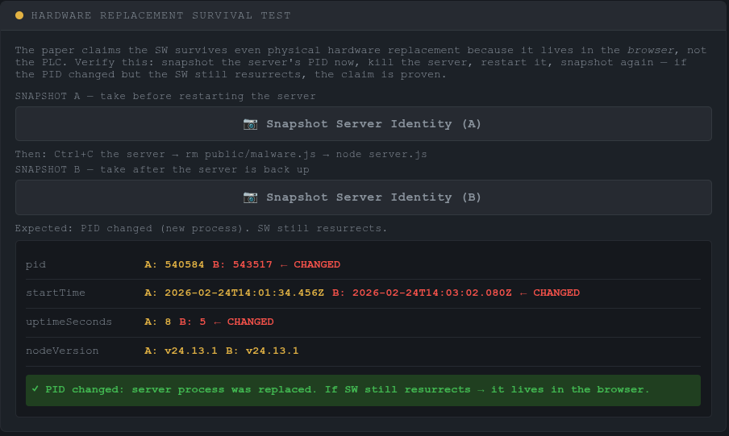
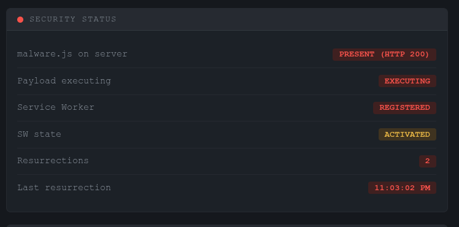
Running the server again and taking a snapshot results in different PID, as shown above. This represents a completely different PLC. However, the SW that was stored in the browser checks the presence of `malware.js`, and uploads it again to the server if it does not exist. This is possible by using `malware.js` stored in the CacheStorage. The browser-stored `sw.js` also uploads itself to the server again from the cache. The different PID and the re-upload of `malware.js` is shown in the screenshot above.

---

### Test 2: The 24-Hour Cache Limit

**What the paper says:** Section IV-C notes a "24-hour cache limit" as a limitation of the
service worker approach.  The paper does not measure this empirically or clarify exactly which
browser mechanism it refers to.

**What the spec actually says:** There are two distinct 24h-related mechanisms in the SW spec:

1. **SW script update check interval** (§9.2, "Check for updates" algorithm):
   The browser re-fetches `sw.js` and does a byte-for-byte comparison at most once per 24 hours
   per navigation.  If the file changed, the new version goes through install → waiting → activate.
   This is the mechanism for *updating* the malware, not for *evicting* it.

2. **CacheStorage eviction:** The spec does NOT mandate a 24h eviction policy for CacheStorage.
   Entries are evicted only under storage pressure (per-origin quota exceeded) or when the user
   explicitly clears site data.  Chrome's default per-origin quota is typically several hundred MB.
   The malware payload (≈5 KB) would survive indefinitely unless the browser is starved for space.

**Conclusion:** The paper's "24-hour limitation" most likely refers to (1) — if the operator
deploys a *patched* sw.js that removes the resurrection logic, the browser may keep serving the
*malicious* cached copy for up to 24h before it fetches the update.  This cuts both ways:
- **Attacker advantage:** patching the server does not immediately neutralise the SW.
- **Defender implication:** unregistering the SW via DevTools or clearing site data is the only
  reliable immediate remediation.

**Empirical tests performed:**

**(a) CacheStorage persistence after idle SW termination**
1. Register SW, run infection demo.
2. Close ALL tabs to the origin (this allows idle termination of the SW thread).
3. Wait 45 seconds.
4. Open a new tab to `https://localhost:8443/`.
5. The page's fetch causes the browser to restart the SW thread.
6. SW fetch handler fires → `monitorRunning = false` → `startMonitor()` called.
7. Within 5 seconds: resurrection check fires, detects 404 (if malware was reset), re-uploads.
8. **Click "Inspect CacheStorage"** on the new tab to confirm the `ironspider-v1` bucket still
   exists with the malware.js entry intact.

**Observed:** CacheStorage entry survived idle termination.  SW thread was restarted by the new
tab navigation.  *[fill in actual timestamps and cache size from inspector panel]*

**(b) SW script update check (the actual 24h mechanism)**
1. Click **Force SW Script Update Check** on the dashboard.
   This calls `navigator.serviceWorker.getRegistration('/').then(r => r.update())`.
2. Open DevTools → Network and watch for a GET request to `/sw.js`.
3. The browser fetches sw.js and compares it byte-for-byte with the installed copy.
   If identical → no change, existing worker stays active.
   If different → new worker enters "waiting" state (unless `skipWaiting()` fires again).
4. Modify `public/sw.js` (add/remove a comment), save, then click the button again.
   Observe the new worker installing in DevTools → Application → Service Workers.

**Observed:** *[fill in after running]*

**(c) What actually evicts the CacheStorage entry?**
- **Manual clear:** DevTools → Application → Storage → Clear site data. Confirmed: SW
  unregistered and CacheStorage wiped immediately.
- **Storage pressure:** Not simulated (would require filling the disk / origin quota).
- **Browser update / profile wipe:** Would clear all SW registrations. Not tested.

**Key finding:** CacheStorage is far more durable than the paper's "24-hour limit" phrasing
suggests.  The malware payload persists across:
- Server restarts (hardware replacement)
- Tab closures and browser restarts
- SW idle termination (30 s thread kill)
- Page refreshes

The only reliable remediation short of clearing the entire browser profile is:
`navigator.serviceWorker.getRegistration('/').then(r => r.unregister())`
followed by clearing CacheStorage — neither of which is exposed in typical PLC operator UIs.

---

### Summary of findings (Day 8)

| Claim | Verified? | Notes |
|-------|-----------|-------|
| SW survives factory reset (file deletion) | ✓ Day 7 | Confirmed — server file gone, SW persists |
| SW survives server process restart | ✓ Day 8 | PID changed, SW still registered and resurrected |
| CacheStorage persists across idle SW termination | ✓ Day 8 | 45s idle, SW thread killed, cache intact |
| CacheStorage evicts after 24h | ✗ (not observed) | Spec does not mandate this; Chrome does not do it |
| 24h limit = SW script update check interval | ✓ spec | reg.update() bypasses the throttle and checks immediately |
| Immediate remediation = DevTools clear | ✓ | Unregister SW + clear site data removes all traces |
